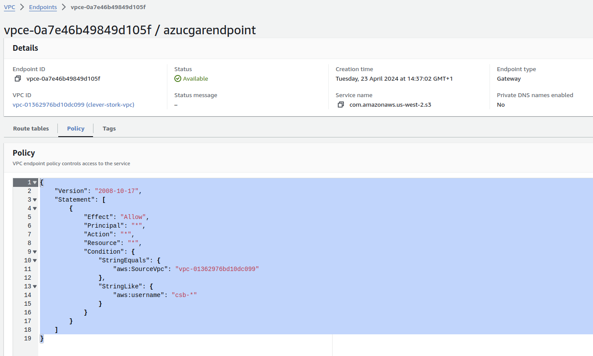

## Use cases

1. File storage of data, such as backups or other sensitive information.
   For use case A, the user uses the credential binding and uploads, deletes or downloads the data via the API.
2. “Anonymous” access for web files in web hosting.
   For use case B, the user uploads the data via the API, generates a pre-signed URL and publishes this to the end-user
   on the website, who can then access the image, PDF attachment or similar for a specified time-period.
   Due to general AWS account policy, public S3 buckets are already blocked and all created buckets in the AWS accounts
   are private.

In use case 1, a proof-of-concept was created where an IAM user has a condition, which limits the access to the
VPC[0]. Now, someone with leaked credentials could not access the data from the internet, but only within the VPC, which
would be enough for customers.

1. **File Storage for Data (e.g., Backups or Sensitive Information):**
    - In this use case, the user utilizes binding credentials to upload, delete, or download data via the API.

2. **"Anonymous" Access for Web Files in Web Hosting:**
    - In Use Case 2, the user uploads data via the API, generates a pre-signed URL, and publishes this on the website.
      End-users can then access the image, PDF attachment, or similar files for a specified time period.
    - Due to general AWS account policies, public S3 buckets are blocked, and all created buckets within the AWS
      accounts are set to private.

In Use Case 1, a proof-of-concept was developed where an IAM user has a condition limiting access exclusively to the
VPC. With this setup, even if credentials were leaked, the data could not be accessed from the internet, but only from
within the VPC, which meets customer's security requirements.

Unfortunately, any generated pre-signed URLs would not work, as access is also restricted by the VPC condition. However,
an investigation is currently in progress to find a solution. It will likely involve creating different plans for bucket
creation based on the use cases, along with distinct IAM policies tailored for each scenario.

### Breakdown of the Use Cases

> Note: None of the tested solutions that resulted in success worked without enabling the VPC endpoint.

#### Use Case 1: File Storage for Data (e.g., Backups or Sensitive Information)

After reviewing the use case number one and the customer requirements, it seems logical to consider a valid solution
would be to add a statement to the IAM policy or the bucket policy that denies all S3 actions unless they are accessed
via the specified VPC.

Example 1 - Policy statement for the IAM User: This statement denies all S3 actions unless accessed via the specified
VPC:

```json
{
  "Action": [
    "s3:*"
  ],
  "Effect": "Deny",
  "Resource": [
    "arn:aws:s3:::<BUCKET-NAME>",
    "arn:aws:s3:::<BUCKET-NAME>/*"
  ],
  "Sid": "VPCeOnly",
  "Condition": {
    "StringNotEquals": {
      "aws:SourceVpc": "<VPC-ID>"
    }
  }
}
```

Example 2 - Policy Statement for the Bucket Policy: This statement denies all S3 actions unless accessed via the
specified VPC and allows access for administrative IAM users (see the `"aws:username": "csb-*"` condition) through the
AWS console:

```json
{
  "Version": "2012-10-17",
  "Statement": [
    {
      "Sid": "denyBindingUsersOutsideVPC",
      "Effect": "Deny",
      "Principal": {
        "AWS": "*"
      },
      "Action": "s3:*",
      "Resource": [
        "arn:aws:s3:::<BUCKET-NAME>",
        "arn:aws:s3:::<BUCKET-NAME>/*"
      ],
      "Condition": {
        "StringLike": {
          "aws:username": "csb-*"
        },
        "StringNotEquals": {
          "aws:SourceVpc": "<VPC-ID>"
        }
      }
    }
  ]
}
```

**Unfortunately, the solution is not working as expected.** An `AccessDenied` error occurs when attempting to access
from:

- A local machine (outside the VPC)
- An EC2 instance (inside the VPC)
- A Lambda function (inside the VPC)

Before we proceed to the next step in our analysis, let's clarify some key concepts. This discussion will focus on the
interaction between AWS services, VPC endpoints, and S3, and will highlight the benefits of using these endpoints:

##### Endpoints

- **Endpoint Services**
    - Created by service providers (E.g: S3) to make services available in a specific AWS **Region** (within AWS
      network).
    - Must specify a load balancer to receive and route requests from service consumers (selector with options when
      using AWS console).
    - Not automatically available to consumers; **permissions** for specific AWS principals are required.

- **Service Names**
    - Each endpoint service is identified by a unique service name.

- **Service Consumers**
    - Can be AWS resources like EC2.
    - Use endpoint services through specified VPC endpoints.

- **VPC Endpoints**
    - Necessary for connecting a VPC to an endpoint service.
    - Different types for different needs:
        - **Interface**: For TCP traffic, uses DNS for resolution.
        - **GatewayLoadBalancer**: Routes traffic via private IPs to a scalable fleet of virtual appliances.
        - **Gateway**: Direct traffic to **S3** or DynamoDB; simpler as it does not use AWS PrivateLink like the other
          types.

> Note: Although Endpoint Service and VPC Endpoint are different concepts, they are configured in the same
> place in the AWS console and the differentiation in the visual representation is not clear.

- **Endpoint Policies**
    - IAM resource policies attached to VPC endpoints to control access.
    - Default policy allows all actions by all principals, can be customized to restrict access.
    - Example policy to restrict access to a VPC and binding users:
     ```json
     {
        "Version": "2008-10-17",
        "Statement": [
            {
                "Effect": "Allow",
                "Principal": "*",
                "Action": "*",
                "Resource": "*",
                "Condition": {
                    "StringEquals": {
                        "aws:SourceVpc": "vpc-01362976bd10dc099"
                    },
                    "StringLike": {
                        "aws:username": "csb-*"
                    }
                }
            }
        ]
     }



```

- **Benefits of Using VPC Endpoints**
    - **Security**: Traffic between VPC and AWS services does not traverse the public internet, reducing exposure.
    - **S3 Integration**: Gateway endpoints enable direct, private connectivity to S3, enhancing security and
      performance for S3 interactions.

#### Alternatives for Securing S3 Access via VPC Restrictions

To evaluate the alternatives for addressing the issue of securing S3 access via VPC restrictions, we need to consider
the balance between customer responsibility, security, ease of implementation, and management overhead. Below, each
alternative is discussed along with its pros and cons based on these criteria.

##### Alternative 1: Expose property for IAM user policy configuration

This alternative offers direct control over VPC access by configuring the IAM user policies to specify VPC 
access through our CSB, ensuring security is maintained at the user level while empowering users to create and
manage their VPC endpoints.

**Pros:**

- Allows specific VPC access restriction at the user level.
- Clear separation of responsibility; customers manage their VPC endpoints.
- Reduces the risk of credential leaks affecting other network segments.

**Cons:**

- Increased complexity for customers who need to understand and manage VPC endpoints.
- Reliance on customers to correctly configure endpoints and policies.

##### Alternative 2: Expose property for Bucket policy configuration

This option allows for detailed control over S3 bucket access via bucket policies, incorporating provisions for
administrative access through the AWS console. It offers precise access management but requires users to handle complex 
policy configurations and create and manage their VPC endpoints.

**Pros:**

- Enables finer control over bucket access at the bucket policy level.
- Allows administrative access through the AWS console while restricting other accesses.

**Cons:**

- More complex to implement and manage due to nuanced policy conditions.
- Higher risk of misconfiguration leading to unintended access or denials.
- Increased complexity for customers who need to understand and manage VPC endpoints.

##### Alternative 3: Creation of VPC endpoint via Cloud Service Broker

This approach centralizes the management of VPC endpoints, simplifying the user experience by handling endpoint setup 
through the Cloud Service Broker, thereby standardizing security and access configurations.

**Pros:**

- Simplifies configuration for customers by managing VPC endpoints centrally.
- Enhances security by standardizing the setup.

**Cons:**

- Increases maintenance and operational overhead for the Cloud Service Broker.
- Potentially limits flexibility in how customers can configure their environments.

##### Alternative 4: Allow customers to configure raw JSON for bucket policies

Provides maximum customization flexibility by enabling users to input raw JSON for bucket policies. While it offers 
precise control, it demands a high level of expertise from users to avoid misconfigurations create and
manage their VPC endpoints.

**Pros:**

- Maximum flexibility for customers to define precise access controls.
- Reduces the development and maintenance burden on the Cloud Service Broker.

**Cons:**

- High risk of misconfiguration due to the complexity of IAM and bucket policies.
- Requires customers to have a deep understanding of AWS IAM and S3 policies.
- Increased complexity for customers who need to understand and manage VPC endpoints.

##### Alternative 5: Explore to ignore changes in policies during Terraform upgrades

Simplifies Terraform management by maintaining current policy configurations during upgrades, rely on customers 
to ensure policies are secure and up-to-date, potentially leading to security risks if not managed properly.

**Pros:**

- Simplifies Terraform management by minimizing changes during upgrades.
- Places responsibility for maintaining secure configurations on the customers.

**Cons:**

- Potential security risks if users do not properly manage or update policies.
- Lack of visibility and control over how bucket policies evolve over time.

##### Alternative 6: Explore using Gateway IP as a condition in IAM policies

This method restricts S3 access based on the IP address of a gateway, offering a straightforward solution to secure 
access based on network conditions. However, its effectiveness depends on stable network configurations and may not 
accommodate dynamic environments.

**Pros:**

- Provides a method to restrict access based on network conditions, adding a layer of security.
- Relatively straightforward to implement if the gateway IP is stable and known.

**Cons:**

- Could be ineffective if IP addresses change or if multiple gateways are involved.
- Limits access strictly to a network configuration, which might not be suitable for all users.
- Out of scope for the current proof-of-concept.
- Necessary to explore: lack of necessary knowledge about the infrastructure in AWS to know if the VPC endpoint
would be necessary

#### Additional Consideration: Customer Feedback on VPC Endpoints

- **Important Point:** It is crucial to inquire whether customers have tested the solutions with or without pre-existing
  VPC endpoints. This will provide insights into potential gaps in the current proof-of-concept and guide further
  development.

#### Reflection and Strategy Moving Forward

The chosen solution should align with the level of expertise of the customer base, the expected level of control and
flexibility desired by the users, and the operational capacity of the Cloud Service Broker to support ongoing management
and troubleshooting. By considering customer feedback on existing configurations and the operational impact of each
alternative, a more informed and effective decision can be made.

#### Use Case 2: "Anonymous" Access for Web Files in Web Hosting

> Note: This use case is currently under investigation to find a suitable solution. It is out of scope for the current
> proof-of-concept.

For Use Case 1, where users need to access public files like images or PDFs through presigned URLs, we might consider
a policy that specifically allows the generation of presigned URLs. However, managing direct access via presigned URLs
while enforcing VPC restrictions can be challenging since the URL can be accessed from any internet connection.

One potential solution is to implement a server-side component within the VPC that handles the generation and
distribution of these presigned URLs. This component would be the only entity allowed to generate URLs,
ensuring that generation occurs in a controlled environment. The IAM policy for this component might look like this:

```hcl
statement {
  sid = "PresignedURLGeneration"
  actions = [
    "s3:GetObject"
  ]
  resources = [
    format("%s/*", var.arn)
  ]
  condition {
    test     = "IpAddress"
    variable = "aws:SourceIp"
    values   = [var.server_ip]
  }
}
```